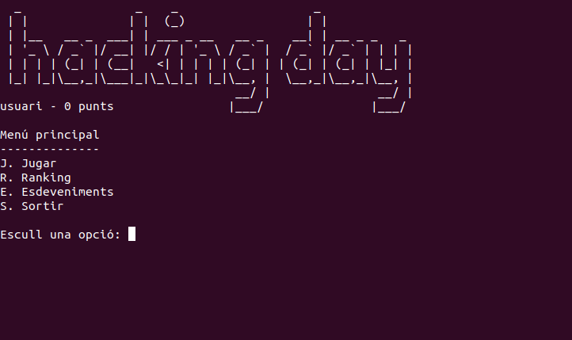
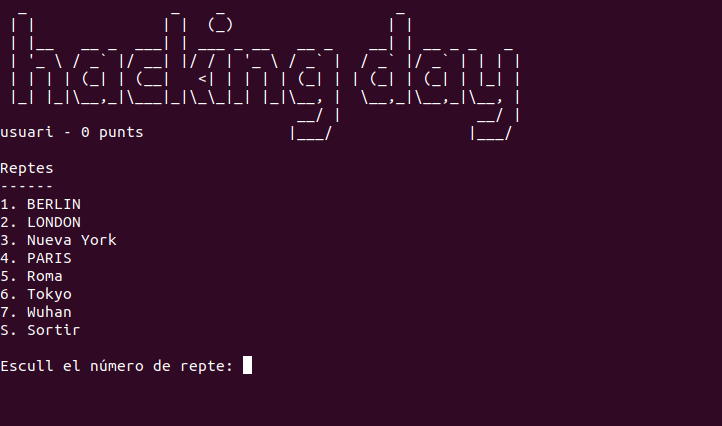
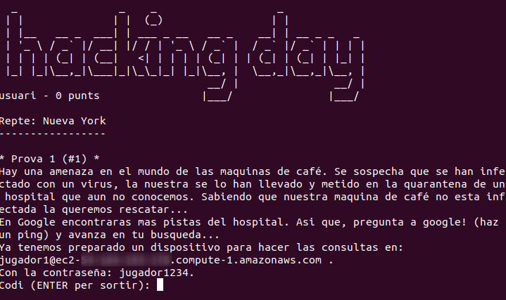

hday
====
Aplicació per gestionar el Hacking Day.

Hacking Day és un joc/competició que consisteix en superar una serie de proves.

Les proves estan organitzades en reptes.

Per superar cada prova s'ha d'indicar un codi correcte.

Arquitectura
============
L'arquitectura de l'aplicació és en capes:
- Presentació: interacció amb l'usuari
- Lògica (de negoci): nucli de l'aplicació.
- Dades + Fitxers: interacció amb el SGBD i els fitxers
  - Dins de la capa de DADES s'utilitza el patró DAO
  
Per cadascuna de les capes hi ha un mòdul amb el nom adient.

https://en.wikipedia.org/wiki/Multitier_architecture#Three-tier_architecture

Per simplificar, la verificació de les dades la realitzarà l'SBGD.

Instal·lació i configuració
===========================

* [debian](docs/installacio-debian.md)
* [ubuntu + AWS](docs/installacio-ubuntu-aws.md)

